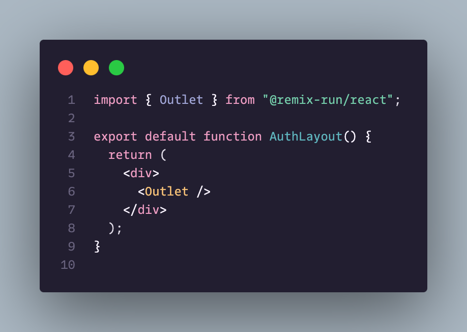

# moegi-space-edit

A one-line edit of the wonderful [Moegi Theme](https://github.com/moegi-design/ghost-theme-Moegi) (Space variant) generated by VS Code's "Generate Color Theme from Current Settings" option.

It changes just one thing - distinguishes React/Vue/(insert_your_favorite_framework) components from regular HTML elements. I prefer having clearly highlighted which element isn't a regular DOM element.

## Regular Moegi Space

## This edited version

